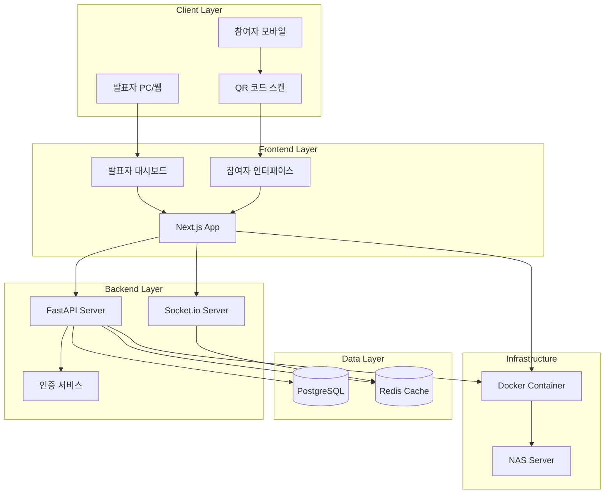
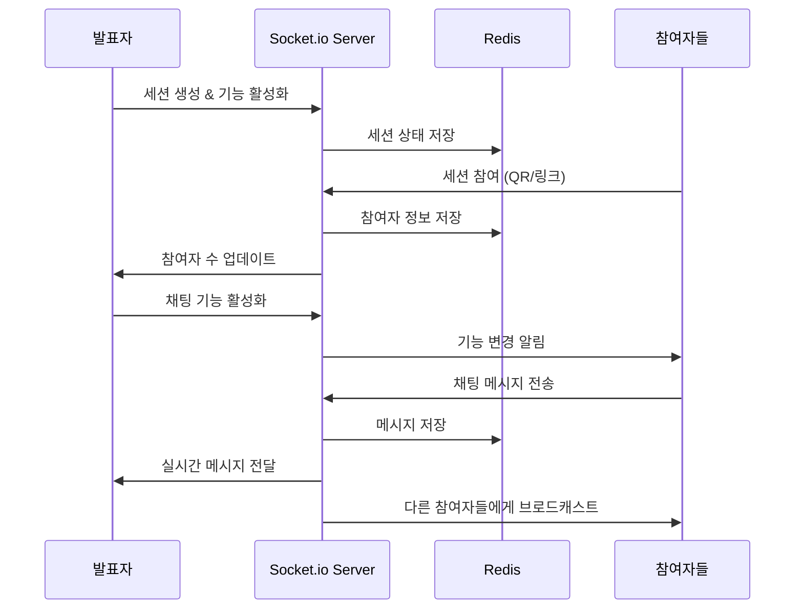
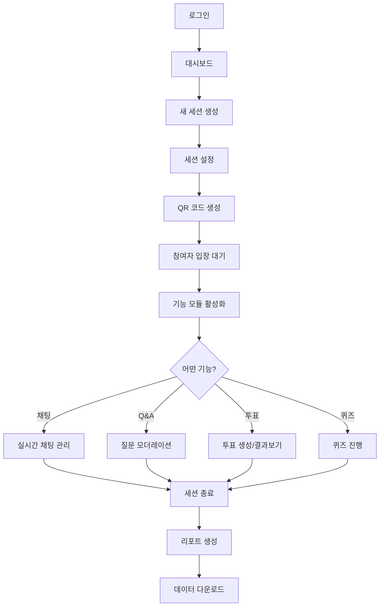
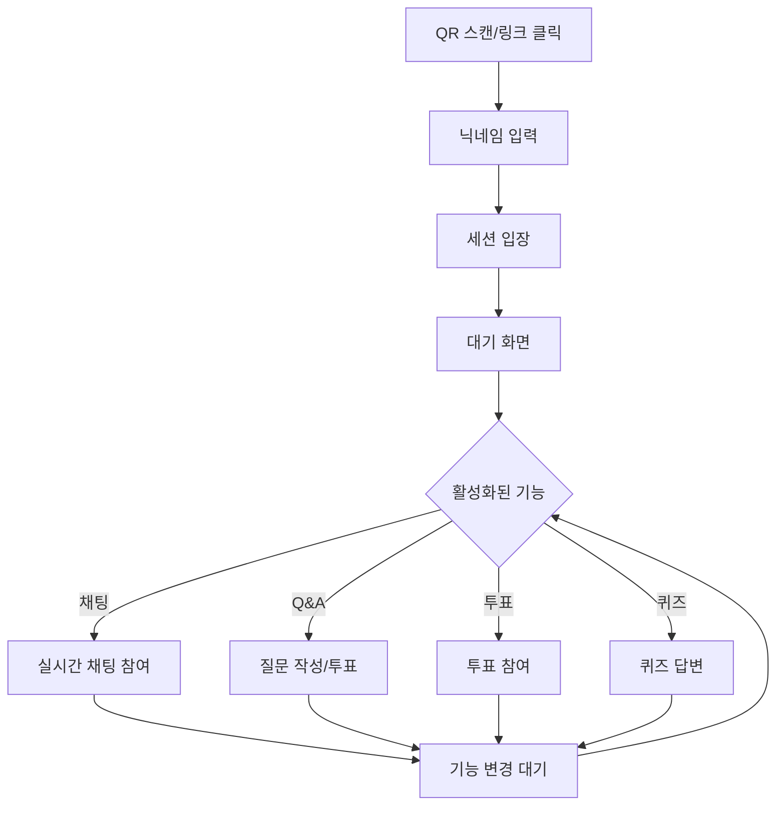
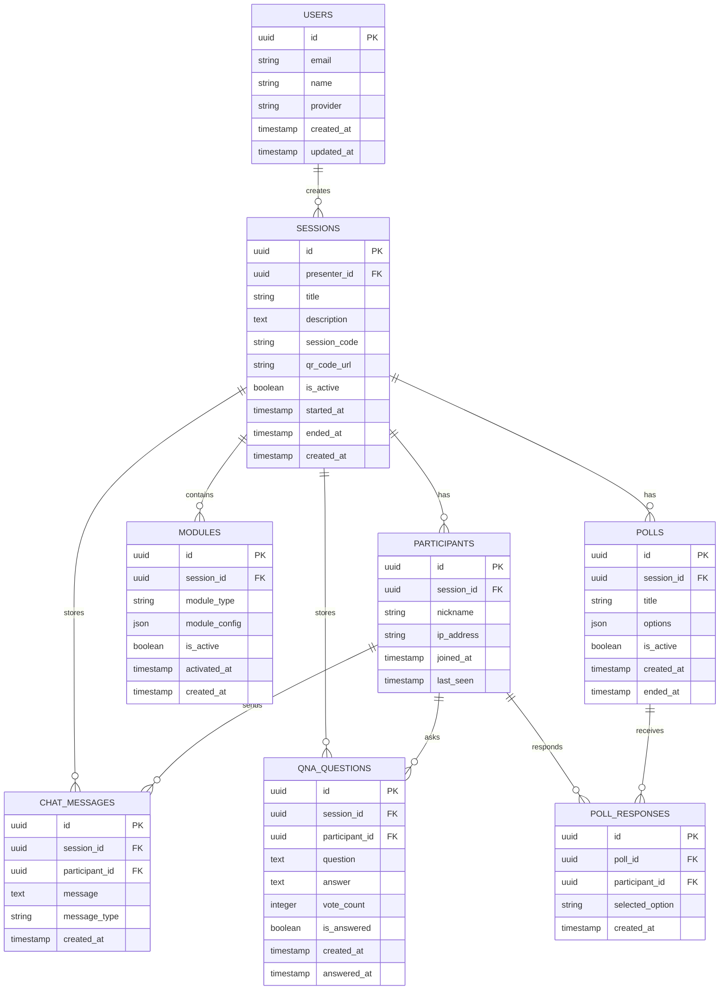

# EngageNow 개발 계획서 (Plan.md)

## 1. PRD 구현 방안

### 1.1 전체 아키텍처 개요

**EngageNow**는 실시간 양방향 소통을 위한 웹 기반 플랫폼으로, 다음과 같은 아키텍처로 구현됩니다:

- **마이크로서비스 아키텍처**: Frontend, Backend API, WebSocket Server, Database 분리
- **실시간 통신**: WebSocket(Socket.io) 기반 양방향 실시간 데이터 교환
- **모듈형 설계**: 기능별 독립적 개발 및 배포 가능한 구조
- **확장 가능성**: 세션당 1,000명 동시 접속 지원

### 1.2 기술 스택 상세

#### Frontend

- **Framework**: Next.js 14 (React 18 기반)
- **UI Library**: Shadcn/ui + Tailwind CSS
- **실시간 통신**: Socket.io-client
- **QR 생성**: qrcode.js
- **상태 관리**: Zustand (가벼운 상태 관리)
- **TypeScript**: 타입 안정성 보장

#### Backend

- **Runtime**: Python 3.11+
- **Framework**: FastAPI (비동기 처리 최적화)
- **실시간 서버**: Socket.io Server (python-socketio)
- **인증**: JWT + OAuth 2.0 (Google)
- **API 문서**: FastAPI 자동 문서 생성

#### Database & Infrastructure

- **주 데이터베이스**: PostgreSQL 15+ (관계형 데이터)
- **캐시 & 세션**: Redis 7+ (실시간 세션 데이터)
- **컨테이너**: Docker & Docker Compose
- **배포**: NAS Docker 환경

### 1.3 핵심 기능 구현 전략

#### 모듈형 기능 시스템

```
기능 모듈 구조:
├── Chat Module (실시간 채팅)
├── QnA Module (질문/답변)
├── Poll Module (투표/설문)
└── Quiz Module (퀴즈)
```

각 모듈은 한 번에 하나의 기능만 On/Off 가능하며, 플러그인 방식으로 확장 가능합니다.

## 2. 시스템 아키텍처 다이어그램

### 2.1 전체 시스템 아키텍처



### 2.2 실시간 통신 플로우



### 2.3 사용자 플로우 다이어그램

#### 발표자 플로우



#### 참여자 플로우



### 2.4 데이터베이스 ERD



## 3. Phase별 구현 단계 분석

### Phase 1: 기본 인프라 및 인증 시스템 (2주)

**목표**: 기본 프로젝트 구조 및 사용자 인증 시스템 구축

**주요 작업**:

- [ ] Docker 개발 환경 설정
- [ ] Next.js + FastAPI 프로젝트 초기 설정
- [ ] PostgreSQL + Redis 데이터베이스 설정
- [ ] Google OAuth 인증 시스템 구현
- [ ] 기본 사용자 관리 API 개발
- [ ] JWT 토큰 기반 인증 시스템 구축

**완료 기준**:

- 발표자가 구글 계정으로 로그인 가능
- 기본 대시보드 접근 가능
- 데이터베이스 연결 및 기본 CRUD 동작

**리스크 & 대응**:

- OAuth 설정 복잡성 → Google Cloud Console 사전 설정
- Docker 환경 문제 → 로컬 개발 환경 대안 준비

### Phase 2: 세션 생성 및 QR 코드 시스템 (2주)

**목표**: 기본 세션 관리 및 참여자 접근 시스템 구축

**주요 작업**:

- [ ] 세션 생성/수정/삭제 API 개발
- [ ] QR 코드 생성 시스템 구현
- [ ] 단축 URL 생성 서비스 구현
- [ ] 참여자 닉네임 입력 시스템
- [ ] 세션별 고유 코드 생성 로직
- [ ] 기본 세션 대시보드 UI 개발

**완료 기준**:

- 발표자가 세션을 생성하고 QR 코드 생성 가능
- 참여자가 QR/링크로 세션 접근 가능
- 실시간 참여자 수 모니터링

**리스크 & 대응**:

- QR 코드 스캔 호환성 → 다양한 기기에서 테스트
- 세션 코드 중복 → UUID 기반 고유성 보장

### Phase 3: 실시간 채팅 기능 (2주)

**목표**: WebSocket 기반 실시간 채팅 시스템 구축 (MVP 완성)

**주요 작업**:

- [ ] Socket.io 서버 설정 및 연결 관리
- [ ] 실시간 채팅 API 개발
- [ ] 메시지 전송/수신 UI 구현
- [ ] 이모지 반응 시스템 구현
- [ ] 채팅 히스토리 저장 및 조회
- [ ] 메시지 모더레이션 기능

**완료 기준**:

- 참여자가 실시간으로 채팅 가능
- 발표자가 채팅을 실시간으로 모니터링 가능
- 메시지 히스토리 저장 및 Export 가능

**기술적 도전**:

- WebSocket 연결 안정성 → 재연결 로직 구현
- 대용량 동시 접속 → Redis를 통한 메시지 큐 관리

### Phase 4: Q&A 시스템 (2주)

**목표**: 질문/답변 및 투표 시스템 구축

**주요 작업**:

- [ ] 참여자 질문 제출 API 개발
- [ ] 자신이 작성한 질문 수정/삭제 기능
- [ ] 질문에 대한 투표 시스템 구현 (좋아요 개수 표시)

**완료 기준**:

- 참여자가 질문 작성 및 다른 질문에 투표 가능
- 참여자가 작성한 질문 수정/삭제 가능
- 질문 좋아요 개수 실시간 반영

### Phase 5: 투표/설문 기능 (2주)

**목표**: 실시간 투표 및 설문조사 시스템 구축

**주요 작업**:

- [ ] 투표/설문 생성 API 개발
- [ ] 다양한 투표 유형 지원 (단일선택, 다중선택, 텍스트)
- [ ] 실시간 투표 결과 시각화
- [ ] 투표 결과 통계 및 분석
- [ ] 발표자가 투표 종료
- [ ] 결과 Export 기능

**완료 기준**:

- 발표자가 다양한 형태의 투표 생성 가능
- 참여자가 투표에 참여하고 실시간 결과 확인 가능
- 투표 결과 데이터 다운로드 가능

### Phase 6: 퀴즈 시스템 (2주)

**목표**: 게임화된 퀴즈 시스템 구축

**주요 작업**:

- [ ] 퀴즈 생성 및 관리 API 개발
- [ ] 다양한 퀴즈 유형 지원 (객관식, OX, 순서)
- [ ] 퀴즈 타이머 및 점수 시스템
- [ ] 실시간 순위표 기능
- [ ] 퀴즈 결과 분석 대시보드
- [ ] 퀴즈 템플릿 시스템

**완료 기준**:

- 발표자가 퀴즈를 생성하고 실시간으로 진행 가능
- 참여자가 퀴즈에 참여하고 점수/순위 확인 가능
- 퀴즈 결과 상세 분석 제공

### Phase 7: 데이터 분석 및 리포트 (2주)

**목표**: 세션 분석 및 리포트 시스템 구축

**주요 작업**:

- [ ] 세션 통계 분석 엔진 개발
- [ ] 참여도 분석 알고리즘 구현
- [ ] 자동 리포트 생성 시스템
- [ ] CSV/PDF Export 기능
- [ ] 대시보드 차트 및 시각화
- [ ] 히스토리 관리 시스템

**완료 기준**:

- 세션 종료 후 발표자가 리포트 생성 버튼 클릭시 리포트 생성
- 다양한 형태의 데이터 Export 가능
- 세션별 상세 분석 대시보드 제공

## 4. 우선순위 매트릭스

### 4.1 기능별 우선순위

| 우선순위          | 기능        | 중요도 | 복잡도 | 비즈니스 가치 | 기술적 의존성         |
| ----------------- | ----------- | ------ | ------ | ------------- | --------------------- |
| **P0 (Critical)** | 인증 시스템 | ⭐⭐⭐ | ⭐⭐   | ⭐⭐⭐        | 모든 기능의 기반      |
| **P0 (Critical)** | 세션 관리   | ⭐⭐⭐ | ⭐⭐   | ⭐⭐⭐        | 핵심 비즈니스 로직    |
| **P0 (Critical)** | 실시간 채팅 | ⭐⭐⭐ | ⭐⭐⭐ | ⭐⭐⭐        | WebSocket 기반 구조   |
| **P1 (High)**     | Q&A 시스템  | ⭐⭐⭐ | ⭐⭐   | ⭐⭐⭐        | 채팅 시스템 기반      |
| **P1 (High)**     | 기본 투표   | ⭐⭐   | ⭐⭐   | ⭐⭐          | Q&A 시스템 확장       |
| **P2 (Medium)**   | 퀴즈 시스템 | ⭐⭐   | ⭐⭐⭐ | ⭐⭐          | 투표 시스템 기반      |
| **P2 (Medium)**   | 고급 분석   | ⭐     | ⭐⭐   | ⭐⭐          | 모든 데이터 수집 완료 |
| **P3 (Low)**      | 고급 UI/UX  | ⭐     | ⭐⭐   | ⭐            | 기본 기능 완성 후     |

### 4.2 MVP (Minimum Viable Product) 정의

**MVP 범위**: Phase 1-3 완료 시점

- ✅ 발표자 인증 및 세션 생성
- ✅ 참여자 QR/링크 접속
- ✅ 실시간 채팅 기능
- ✅ 기본 참여자 모니터링

**MVP 출시 기준**:

- 세션당 최소 100명 동시 접속 지원
- 실시간 메시지 지연 < 200ms
- 모바일 브라우저 호환성 90%+
- 기본 보안 요구사항 충족

### 4.3 기술적 위험도 분석

| 위험 요소         | 확률 | 영향도 | 대응 전략                  |
| ----------------- | ---- | ------ | -------------------------- |
| WebSocket 확장성  | 중간 | 높음   | Redis Adapter + 로드밸런싱 |
| 동시 접속 성능    | 높음 | 높음   | 단계적 성능 테스트         |
| OAuth 인증 복잡성 | 낮음 | 중간   | 표준 라이브러리 사용       |
| Docker 배포 환경  | 중간 | 중간   | 로컬 환경 대안 준비        |
| 모바일 호환성     | 중간 | 높음   | 반응형 디자인 우선         |

### 4.4 성공 지표 (KPI)

**기술적 KPI**:

- 응답시간: < 100ms (API), < 200ms (실시간 기능)
- 가용성: 99.5% 이상
- 동시 접속: 세션당 1,000명 지원
- 모바일 호환성: 95% 이상

**비즈니스 KPI**:

- 사용자 만족도: 4.0/5.0 이상
- 세션 완료율: 90% 이상
- 참여자 이탈률: 15% 이하
- 기능 사용률: 각 기능별 70% 이상

## 5. 다음 단계: task.md 작성 가이드

본 plan.md를 바탕으로 다음 **task.md** 파일에서는:

1. **각 Phase별 상세 작업 분해**: CaludeCode가 작업 가능한 단위 작업으로 분할
2. **기술적 구현 명세**: API 스펙, 데이터베이스 스키마, UI 컴포넌트 상세
3. **테스트 계획**: 단위/통합/E2E 테스트 시나리오
4. **배포 전략**: CI/CD 파이프라인 및 배포 체크리스트
5. **품질 관리**: 코드 리뷰, 성능 테스트, 보안 검토 기준

이를 통해 개발팀이 체계적이고 효율적으로 **EngageNow** 플랫폼을 구현할 수 있도록 지원합니다.

다음으로 @interactive-presentation-prd.md 기준으로 작성된, @plan.md 를 바탕으로 task.md 파일을 작성해줘.
task.md 파일의 작성은 @plan.md 에서 `## 5. 다음 단계: task.md 작성 가이드`를 참고하여 작성해야 해.
